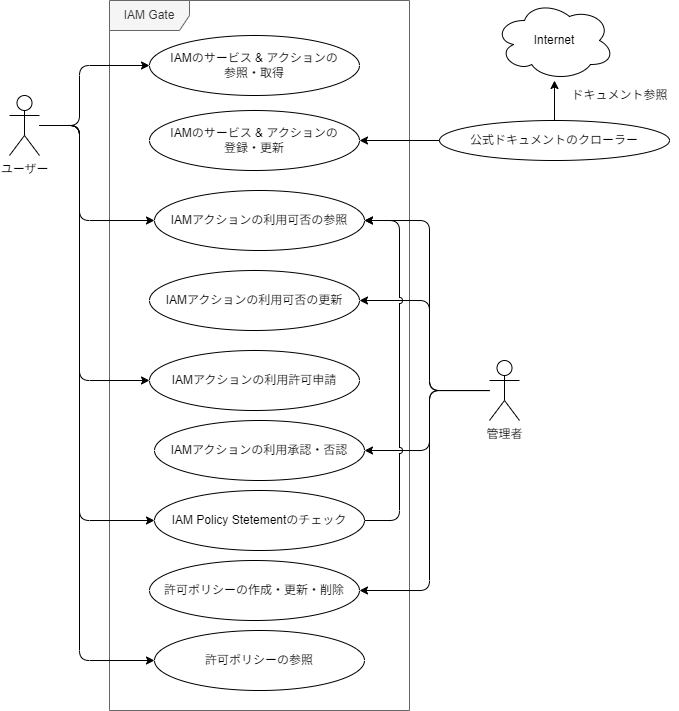

# IAM Gate のユースケース

## 概要

IAM Gate におけるユースケースを整理します。

## ユースケース図

## ユースケース

ユースケースは大きく分けて 4 つのカテゴリに分かれています。

1. IAM Action 管理
2. IAM Action 利用可否管理
3. IAM Action 利用申請
4. IAM Policy チェック
5. IAM Policy リポジトリ

## ユースケース詳細

### 1. IAM Action 管理

IAM Action 管理は、IAM Action の参照・登録・更新・削除を行うユースケースです。

#### アクター

- IAM Gate 管理者
- 一般ユーザー
- 公式ドキュメントクローラー

#### 機能詳細

- IAM Action の参照
  - 特定のサービスに関連する IAM Action の一覧を取得できる
  - 特定の IAM Action の詳細情報を取得できる (1 件参照)
  - 複数の IAM Action の詳細情報を取得できる (サービスは一つに限定しない)
  - アクション名の部分一致検索できる
  - アクション名の完全一致検索できる
  - アクション名の正規表現検索できる
  - アクションの説明文の部分一致検索できる
  - アクションレベルによるフィルタリングできる
  - 各サービスごとの IAM Action の件数を取得できる
  - サービスおよびアクションの最終更新日時を取得できる
- IAM Action の登録
  　- サービスとサービスプレフィックス、アクション名、アクションの説明文、アクションの詳細ページ URL、アクションレベルを登録できる
  　- (Optional) リソースタイプを登録できる
  　- (Optional) 条件キーを登録できる
  　- (Optional) アクションの説明文を更新できる
- IAM Action の更新
  - サービスとサービスプレフィックス、アクション名、アクションの説明文、アクションの詳細ページ URL、アクションレベルを更新できる
  - (Optional) リソースタイプを更新できる
  - (Optional) 条件キーを更新できる
  - (Optional) アクションの説明文を更新できる
- IAM Action の削除
  - 最終更新日時が特定の日時よりも古い IAM Action を削除できる

#### アクターと機能の対応表

各機能に対して〇がついているアクターはその機能を利用できることを示します。

| 機能              | 機能詳細                              | IAM Gate 管理者 | 一般ユーザー | 公式ドキュメントクローラー |
| :---------------- | :------------------------------------ | :-------------: | :----------: | :------------------------: |
| IAM Action の参照 | 特定サービスの IAM Action 一覧取得    |       〇        |      〇      |             ×              |
|                   | 特定 IAM Action の詳細取得            |       〇        |      〇      |             ×              |
|                   | 複数 IAM Action の詳細取得            |       〇        |      〇      |             ×              |
|                   | アクション名の部分一致検索            |       〇        |      〇      |             ×              |
|                   | アクション名の完全一致検索            |       〇        |      〇      |             ×              |
|                   | アクション名の正規表現検索            |       〇        |      〇      |             ×              |
|                   | アクション説明文の部分一致検索        |       〇        |      〇      |             ×              |
|                   | アクションレベルによるフィルタ        |       〇        |      〇      |             ×              |
|                   | サービスごとの IAM Action 件数取得    |       〇        |      〇      |             ×              |
|                   | サービス/アクションの最終更新日時取得 |       〇        |      〇      |             ×              |
| IAM Action の登録 | サービス・アクション情報登録          |        ×        |      ×       |             〇             |
|                   | (Optional)リソースタイプ登録          |        ×        |      ×       |             〇             |
|                   | (Optional)条件キー登録                |        ×        |      ×       |             〇             |
|                   | (Optional)アクション説明文更新        |        ×        |      ×       |             〇             |
| IAM Action の更新 | サービス・アクション情報更新          |        ×        |      ×       |             〇             |
|                   | (Optional)リソースタイプ更新          |        ×        |      ×       |             〇             |
|                   | (Optional)条件キー更新                |        ×        |      ×       |             〇             |
|                   | (Optional)アクション説明文更新        |        ×        |      ×       |             〇             |
| IAM Action の削除 | 最終更新日時による削除                |       〇        |      ×       |             ×              |

### 2. IAM Action 利用可否管理

IAM Action 利用可否管理は、IAM Action の利用可否を登録・更新・削除するユースケースです。

#### アクター

- IAM Gate 管理者
- 一般ユーザー

#### 機能詳細

> 後で記載

#### アクターと機能の対応表

> 後で記載

### 3. IAM Action 利用申請

IAM Action 利用申請は、IAM Action の利用を申請するユースケースです。

#### アクター

- IAM Gate 管理者
- 一般ユーザー

#### 機能詳細

> 後で記載

#### アクターと機能の対応表

> 後で記載

### 4. IAM Policy チェック

IAM Policy チェックは、IAM Policy のチェックを行うユースケースです。

#### アクター

- IAM Gate 管理者
- 一般ユーザー
- 他システム

#### 機能詳細

> 後で記載

#### アクターと機能の対応表

> 後で記載

### 5. IAM Policy リポジトリ

IAM Policy リポジトリは、IAM Policy のリポジトリを提供するユースケースです。

#### アクター

- IAM Gate 管理者
- 一般ユーザー

#### 機能詳細

> 後で記載

#### アクターと機能の対応表

> 後で記載
