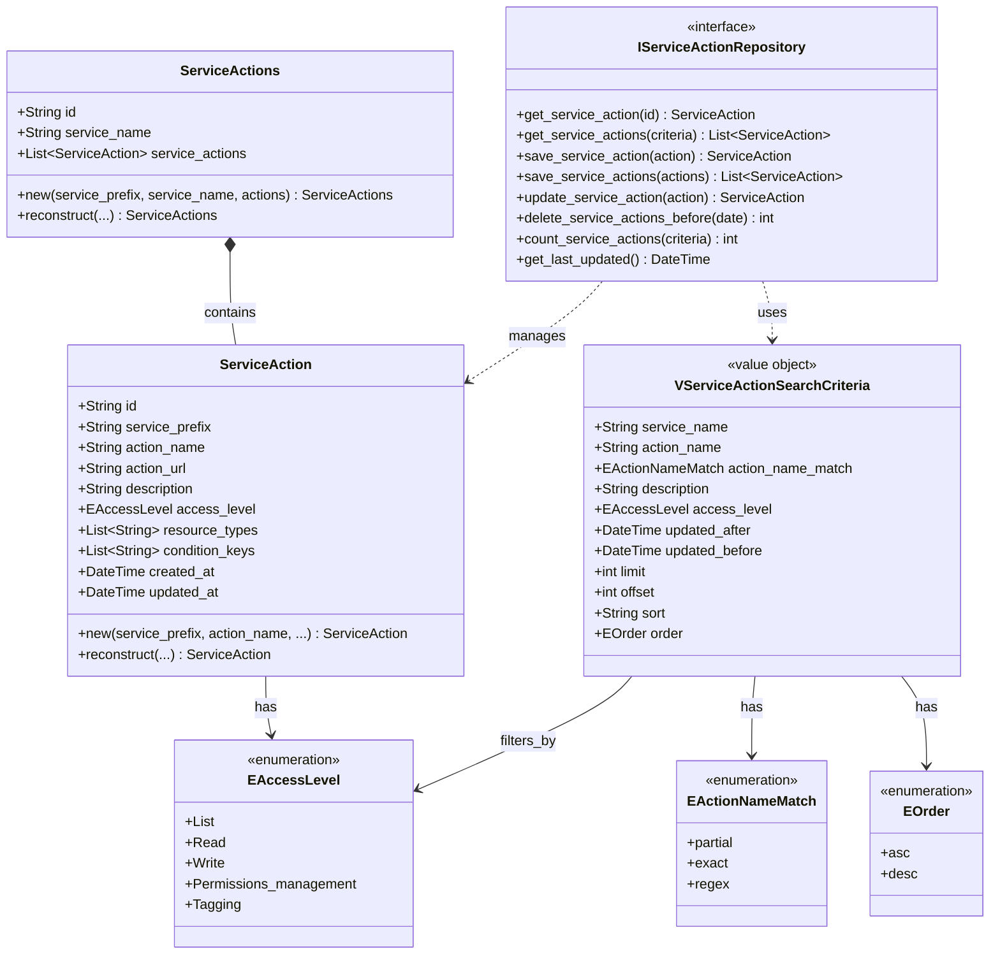

# Service Action ドメインモデル設計

## 概要
IAM GateにおけるService Actionドメインのモデル設計を整理します。

---

## ドメインモデル図

---

## エンティティ詳細

### ServiceAction（エンティティ）
- **責任**: 個別のIAMアクションを表現
- **識別子**: `id` (`service_prefix:action_name`形式)
- **不変条件**: 
  - `id`は`service_prefix:action_name`の形式
  - `action_url`はAWSドキュメントドメインのみ
  - `access_level`は定義済みの値のみ

### ServiceActions（集約ルート）
- **責任**: サービス単位でのアクション集合を管理
- **識別子**: `id` (service_prefix)
- **不変条件**: 
  - 同一サービス内でアクション名の重複なし
  - `service_actions`内の全アクションは同一`service_prefix`

### VServiceActionSearchCriteria（値オブジェクト）
- **責任**: 検索条件を表現
- **特徴**: 不変、等価性比較可能
- **バリデーション**: 
  - `limit`: 1-1000
  - `offset`: 0以上
  - `regex`: 最大500文字

---

## リポジトリインターフェース設計

### 主要メソッド

#### 参照系
- `get_service_action(id: str) -> ServiceAction | None`
- `get_service_actions(criteria: VServiceActionSearchCriteria) -> List[ServiceAction]`
- `count_service_actions(criteria: VServiceActionSearchCriteria) -> int`
- `get_last_updated() -> DateTime | None`

#### 更新系
- `save_service_action(action: ServiceAction) -> ServiceAction`
- `save_service_actions(actions: List[ServiceAction]) -> List[ServiceAction]`
- `update_service_action(action: ServiceAction) -> ServiceAction`
- `delete_service_actions_before(updated_before: DateTime) -> int`

---

## 設計上の考慮事項

### 1. 集約の境界
- **ServiceAction**: 個別のアクション（エンティティ）
- **ServiceActions**: サービス単位の集約（クローラー用）
- APIでは主にServiceActionを個別に扱う

### 2. 永続化戦略
- ServiceActionを中心とした正規化テーブル設計
- ServiceActionsは導出可能な概念として扱う

### 3. 検索性能
- `service_name`, `action_name`, `access_level`, `updated_at`にインデックス
- 正規表現検索は制限付きで提供

### 4. 拡張性
- `resource_types`, `condition_keys`は将来的な拡張を考慮
- 現在は文字列配列として実装

---

## 次のステップ

1. **リポジトリインターフェースの実装**
2. **データベーステーブル設計**
3. **PostgreSQLリポジトリ実装**
4. **ユースケース層の実装**
